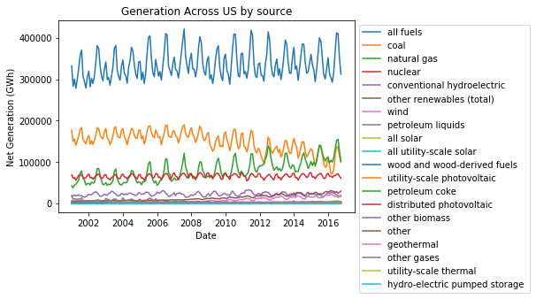

Title: My first test
Author: Jehosophat Mackrory
Date: Sep 25, 2018
Category: Nonsense

# A first test webpage.

Welcome to my blog.  It's currently under construction, as I learn the ropes 
of Github and Jupyter's interfaces.  I look forward to getting Markdown to 
actually respect LaTeX's math (particularly amsmath, amssym).  Maybe Emacs's syntax highlighting
will work. 

Probably beats assembling figures by hand in postscript though. 

Behold, a figure from Jupyter.  It probably does not display just yet, but we'll fix that soon. 
